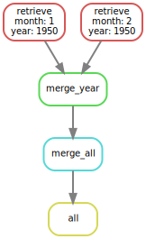

[`singularity` & `snakemake`](https://github.com/sylvainschmitt/snakemake_singularity) 
workflow to retrieve climatic data from ERA5-Land on CDS using python cdsapi.
The config file is configure for French Guiana spanning all month from 1950 to 2022.

```{r dag, fig.cap="Workflow."}

```

# Installation

- [x] Python ≥3.5
- [x] Snakemake ≥5.24.1
- [x] Golang ≥1.15.2
- [x] Singularity ≥3.7.3
- [x] This workflow

```{bash, eval=F, echo=T}
# Python
sudo apt-get install python3.5
# Snakemake
sudo apt install snakemake`
# Golang
export VERSION=1.15.8 OS=linux ARCH=amd64  # change this as you need
wget -O /tmp/go${VERSION}.${OS}-${ARCH}.tar.gz https://dl.google.com/go/go${VERSION}.${OS}-${ARCH}.tar.gz && \
sudo tar -C /usr/local -xzf /tmp/go${VERSION}.${OS}-${ARCH}.tar.gz
echo 'export GOPATH=${HOME}/go' >> ~/.bashrc && \
echo 'export PATH=/usr/local/go/bin:${PATH}:${GOPATH}/bin' >> ~/.bashrc && \
source ~/.bashrc
# Singularity
mkdir -p ${GOPATH}/src/github.com/sylabs && \
  cd ${GOPATH}/src/github.com/sylabs && \
  git clone https://github.com/sylabs/singularity.git && \
  cd singularity
git checkout v3.7.3
cd ${GOPATH}/src/github.com/sylabs/singularity && \
  ./mconfig && \
  cd ./builddir && \
  make && \
  sudo make install
# detect Mutations
git clone git@github.com:sylvainschmitt/getEra.git
cd getEra
```

# Usage

### Locally

```{bash, eval=F, echo=T}
snakemake -np -j 1 --resources mem_mb=10000 # dry run
snakemake --dag | dot -Tsvg > dag/dag.svg # dag
snakemake -j 1 --resources mem_mb=10000 # run
```

### HPC

```{bash, eval=F, echo=T}
module load bioinfo/snakemake-5.25.0 # for test on node
snakemake -np # dry run
sbatch job_genologin.sh # run
```

# Workflow

### [retrieve](https://github.com/sylvainschmitt/smkTemplate/blob/main/rules/retrieve.py)

* Script: [`retrieve.py`](https://github.com/sylvainschmitt/smkTemplate/blob/main/scripts/retrieve.py)
* Tool: https://github.com/ecmwf/cdsapi
* Singularity: https://github.com/sylvainschmitt/singularity-cdsapi

### [merge_year](https://github.com/sylvainschmitt/smkTemplate/blob/main/rules/merge_year.py)

* Tool: https://code.mpimet.mpg.de/projects/cdo/embedded/index.html#x1-40001.1.1
* Singularity: docker://alexgleith/cdo

### [merge_all](https://github.com/sylvainschmitt/smkTemplate/blob/main/rules/merge_all.py)

* Tool: https://code.mpimet.mpg.de/projects/cdo/embedded/index.html#x1-40001.1.1
* Singularity: docker://alexgleith/cdo

# CDS API

Get your user ID (UID) and API key from the CDS portal at the address 
https://cds.climate.copernicus.eu/user and write it into the configuration file,
so it looks like:

```
$ cat ~/.cdsapirc
url: https://cds.climate.copernicus.eu/api/v2
key: <UID>:<API key>
verify: 0
```

Remember to agree to the Terms and Conditions of every 
dataset that you intend to download.
